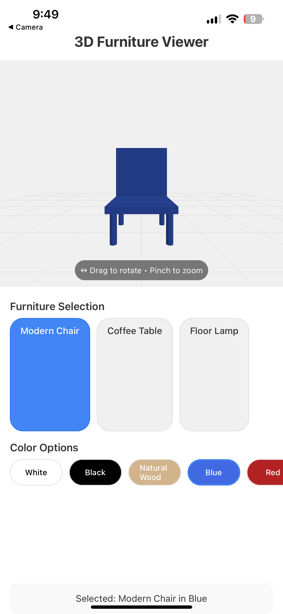
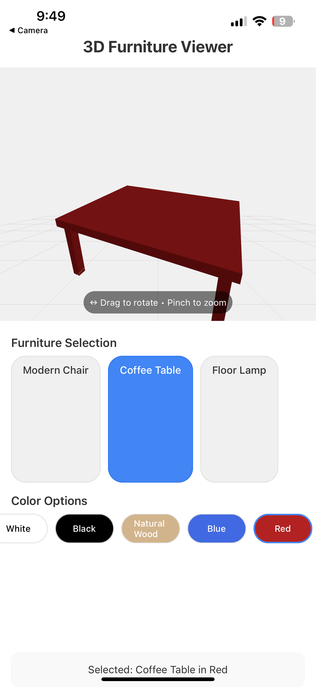
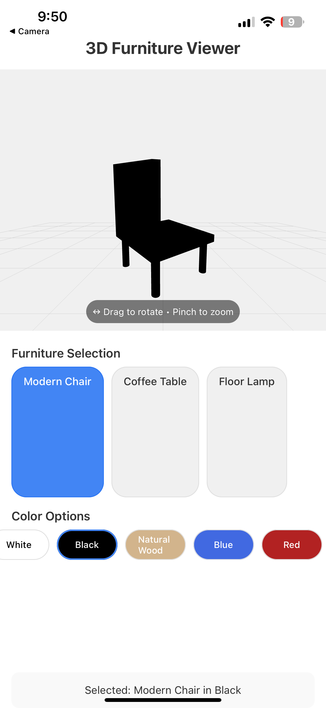
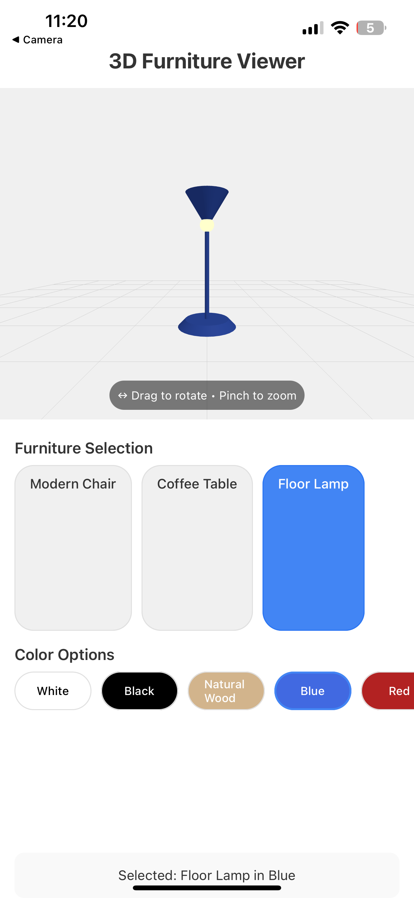

### 3D Furniture Viewer

A React Native application that provides an interactive 3D visualization experience for furniture items with intuitive touch gestures and real-time color customization.

| Screen 1                | Screen 2                |
| ----------------------- | ----------------------- |
|  |  |
| Screen 3                | Screen 4                |
|  |  |

## 🌟 Features

- **Interactive 3D Models**: View furniture items (chair, table, lamp) in full 3D with smooth rotation
- **Intuitive Touch Controls**: Rotate models with drag gestures and zoom with pinch gestures
- **Real-time Color Customization**: Change furniture colors instantly with a tap
- **Responsive Design**: Works across different device sizes and orientations
- **Optimized Performance**: Efficient rendering for smooth interaction even on mid-range devices

## 🛠️ Technologies

- **React Native**: Core framework for cross-platform mobile development
- **Expo**: Development platform and toolchain
- **Three.js / Expo Three**: 3D rendering engine
- **React Native Gesture Handler**: Touch gesture recognition and processing
- **TypeScript**: Type-safe JavaScript for improved development experience

## 📋 Prerequisites

- Node.js (v14 or newer)
- npm or yarn
- Expo CLI
- iOS Simulator or Android Emulator (or physical device with Expo Go app)

## 🚀 Installation

1. Clone the repository:

```shellscript
git clone https://github.com/yourusername/3d-furniture-viewer.git
cd 3d-furniture-viewer
```

2. Install dependencies:

```shellscript
npm install
# or
yarn install
```

3. Start the Expo development server:

```shellscript
npx expo start
```

4. Run on your preferred platform:

1. Press `i` for iOS simulator
1. Press `a` for Android emulator
1. Scan the QR code with Expo Go app on your physical device

## 📱 Usage

### Viewing 3D Models

1. Launch the application to see the default furniture item (Modern Chair in White)
2. The 3D model appears in the central viewing area

### Interacting with Models

- **Rotate**: Touch and drag anywhere on the model

- Drag left/right to rotate horizontally (Y-axis)
- Drag up/down to rotate vertically (X-axis)

- **Zoom**: Use a two-finger pinch gesture

- Pinch in to zoom closer
- Pinch out to zoom farther

### Changing Furniture

Tap any item in the "Furniture Selection" horizontal scrollable menu:

- **Modern Chair**: A contemporary chair with simple lines
- **Coffee Table**: A rectangular coffee table with four legs
- **Floor Lamp**: A standing lamp with base, pole, and shade

### Changing Colors

Tap any color in the "Color Options" horizontal scrollable menu:

- **White**: Clean, modern appearance (default)
- **Black**: Bold, dramatic styling
- **Natural Wood**: Warm, traditional finish
- **Blue**: Vibrant accent piece
- **Red**: Bold statement color

## 📁 Project Structure

```plaintext
3d-furniture-viewer/
├── App.tsx                 # Main application component
├── components/             # Reusable UI components
├── types/                  # TypeScript type definitions
├── hooks/                  # Custom React hooks
├── utils/                  # Utility functions
├── assets/                 # Static assets
└── app.json                # Expo configuration
```

## 🧩 Code Architecture

The application follows a component-based architecture with careful state management for optimal performance:

### Key Components

1. **State Management**:

1. React State (`useState`) for UI-related state
1. React Refs (`useRef`) for 3D objects and gesture state

1. **3D Rendering**:

1. WebGL context initialization via Expo GL
1. Three.js scene, camera, and lighting setup
1. Procedural 3D model generation using geometric primitives

1. **Gesture Controls**:

1. Pan gesture for rotation with delta-based tracking
1. Pinch gesture for zoom with absolute scale application
1. Gesture composition for simultaneous interactions

1. **UI Integration**:

1. Selection menus for furniture items and colors
1. Loading state management with visual feedback
1. Interaction hints for user guidance

## 🔍 Technical Challenges and Solutions

### 1. Efficient 3D Model Creation

**Challenge**: Creating realistic 3D furniture models without external model files.

**Solution**: Implemented procedural generation using Three.js primitives, combining simple shapes into recognizable furniture pieces. This approach reduces app size, improves loading times, and simplifies color customization.

### 2. Smooth Rotation Control

**Challenge**: Creating intuitive rotation that follows the user's finger precisely.

**Solution**: Implemented delta-based rotation tracking that calculates the change between touch events rather than absolute positions. Applied appropriate sensitivity multipliers and maintained rotation state between frames for smooth continuation.

### 3. Reliable Zoom Control

**Challenge**: Implementing pinch-to-zoom that feels natural and maintains appropriate constraints.

**Solution**: Stored the initial camera position at the start of each pinch gesture and applied the scale factor directly to this position. Added minimum and maximum constraints to prevent extreme zoom levels, and properly updated the reference position at the end of each gesture.

## 🔮 Future Improvements

- **AR Integration**: Add the ability to place furniture in real-world environments using AR
- **Additional Furniture Models**: Expand the catalog with more furniture types and styles
- **Material Customization**: Allow users to change materials beyond just colors (wood grain, metal, fabric)
- **Scene Composition**: Enable users to arrange multiple furniture pieces in a virtual room
- **Measurement Tools**: Add the ability to view and customize dimensions
- **Export/Share**: Allow users to export or share their customized furniture designs
- **Persistence**: Save user preferences and custom configurations

## 📊 Performance Considerations

The application implements several optimizations for smooth performance:

- **Ref-Based State Management**: Prevents unnecessary re-renders
- **Primitive-Based Models**: Uses simple geometric shapes for better performance
- **Material Sharing**: Reuses materials across components to reduce state changes
- **Animation Frame Management**: Properly tracks and cancels animation frames
- **Optimized Lighting**: Uses minimal lighting setup for good visual quality

## 🧪 Testing

Run the test suite with:

```shellscript
npm test
# or
yarn test
```

The application includes:

- Unit tests for core functionality
- Component tests for UI elements
- Integration tests for gesture interactions

## 📚 Documentation

For detailed technical documentation, see:

- [Technical Implementation](docs/technical-implementation.md)
- [API Reference](docs/api-reference.md)
- [Gesture System](docs/gesture-system.md)

## 🤝 Contributing

Contributions are welcome! Please feel free to submit a Pull Request.

1. Fork the repository
2. Create your feature branch (`git checkout -b feature/amazing-feature`)
3. Commit your changes (`git commit -m 'Add some amazing feature'`)
4. Push to the branch (`git push origin feature/amazing-feature`)
5. Open a Pull Request

## 📄 License

This project is licensed under the MIT License - see the [LICENSE](LICENSE) file for details.

## 👏 Acknowledgments

- [Three.js](https://threejs.org/) for the powerful 3D rendering capabilities
- [Expo](https://expo.dev/) for the excellent React Native development experience
- [React Native Gesture Handler](https://docs.swmansion.com/react-native-gesture-handler/) for the gesture recognition system
- [CSCI 5708 Mobile Computing](https://www.dal.ca/) course for the project inspiration

---

Developed by [Kandarp Patel](https://github.com/yourusername) - B00992429
